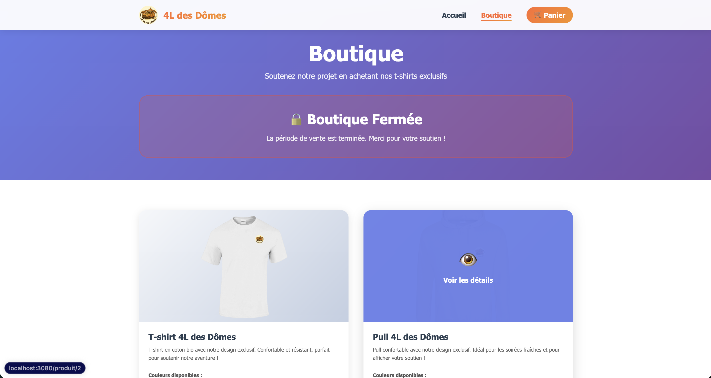
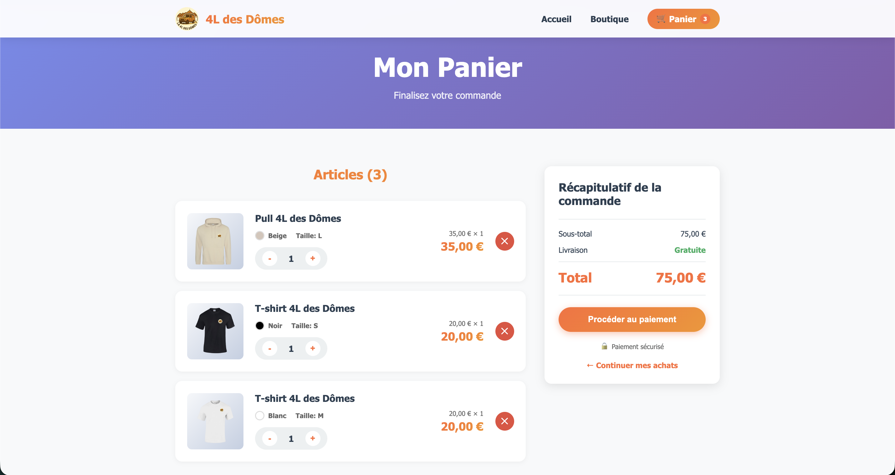

# 4L des Dômes — Site Web clé en main pour le 4L Trophy

> Un site web e-commerce complet, moderne et prêt à l'emploi pour financer votre aventure au 4L Trophy. Boutique en ligne, gestion des commandes, paiement sécurisé — tout est là.

---

## Apercu

### Boutique en ligne



Une boutique épurée et efficace pour vendre vos t-shirts et pulls à vos soutiens. Gestion du stock en temps réel, galerie produits avec visuels, sélection des tailles et couleurs disponibles.

### Panier et commande



Tunnel d'achat fluide : panier récapitulatif, livraison gratuite, paiement sécurisé via HelloAsso. Vos acheteurs passent commande en moins d'une minute.

---

## Ce que vous obtenez

- **Site vitrine** — Présentez votre équipe, votre projet et votre parcours au 4L Trophy
- **Boutique e-commerce** — Vendez vos produits (t-shirts, pulls, accessoires) directement en ligne
- **Gestion du panier** — Panier persistant, mise à jour des quantités, récapitulatif de commande clair
- **Paiement sécurisé** — Intégration Stripe, paiement par carte bancaire
- **Stock en temps réel** — Les quantités se mettent à jour automatiquement à chaque commande
- **Administration des commandes** — Toutes les commandes centralisées en base de données
- **Responsive** — Design adapté mobile et desktop
- **Animations soignées** — Scroll animations, transitions fluides, design moderne

---

## Technologies

| Couche          | Stack                                          |
| --------------- | ---------------------------------------------- |
| Frontend        | Vue.js 3, Vite, Pinia, Vue Router, Axios       |
| Backend         | Spring Boot 3.2, Java 21, Spring Security, JWT |
| Base de données | PostgreSQL 16                                  |
| Infrastructure  | Docker, Docker Compose, Nginx                  |

---

## Démarrage rapide

### Prérequis

- Docker et Docker Compose

### Lancer le projet

```bash
git clone <repo-url>
cd La-4L-des-d-mes
docker-compose up --build
```

L'application est accessible sur :

- **Frontend** : <http://localhost:3080>
- **Backend API** : <http://localhost:8080/api>

### Développement local

```bash
# Backend
cd backend && mvn spring-boot:run

# Frontend
cd frontend && npm install && npm run dev
```

---

## Architecture

```text
.
├── backend/                    # Spring Boot
│   └── src/main/java/com/fourltroph/
│       ├── controller/         # REST Controllers
│       ├── service/            # Business Logic
│       ├── entity/             # JPA Entities
│       └── config/             # Security, CORS, JWT
│
├── frontend/                   # Vue.js 3
│   └── src/
│       ├── views/              # Home, Shop, Cart
│       ├── components/         # Navbar, Footer
│       └── stores/             # Pinia (panier)
│
└── docker-compose.yml
```

---

## API Backend

| Méthode  | Route                      | Description               |
| -------- | -------------------------- | ------------------------- |
| `GET`    | `/api/products`            | Liste tous les produits   |
| `GET`    | `/api/products/available`  | Produits en stock         |
| `GET`    | `/api/products/{id}`       | Détails d'un produit      |
| `POST`   | `/api/orders`              | Créer une commande        |
| `GET`    | `/api/orders/{id}`         | Détails d'une commande    |

---

## Variables d'environnement

### Backend

| Variable        | Défaut           | Description                  |
| --------------- | ---------------- | ---------------------------- |
| `DB_HOST`       | `localhost`      | Hôte PostgreSQL              |
| `DB_PORT`       | `5432`           | Port PostgreSQL              |
| `DB_NAME`       | `fourltroph`     | Nom de la base               |
| `DB_USER`       | `fourltroph`     | Utilisateur                  |
| `DB_PASSWORD`   | `fourltroph2026` | Mot de passe                 |
| `JWT_SECRET`    | —                | Secret JWT                   |
| `CORS_ORIGINS`  | —                | Origines CORS autorisées     |

### Frontend

| Variable        | Défaut                          |
| --------------- | ------------------------------- |
| `VITE_API_URL`  | `http://localhost:8080/api`     |

---

## Sécurité

- CORS configuré par origines autorisées
- Spring Security avec JWT (infrastructure en place)
- Validation des données côté backend (Bean Validation)
- Credentials configurables via variables d'environnement

---

## Licence

MIT

---

**4L des Dômes** — Équipe 4L Trophy 2026

## Author

Bastien Jacquelin
